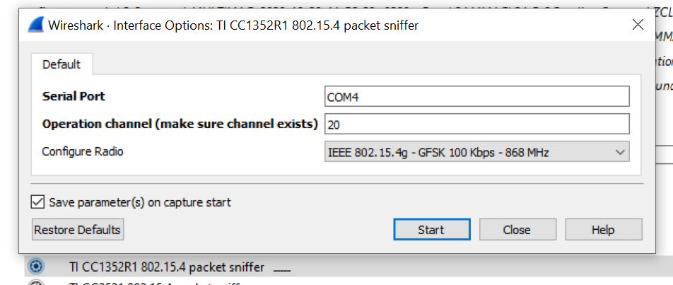

# wireshark_extcap_cc1352r1

Wireshark extcap interface for the Texas Instruments cc1352r1 USB dongle with a modified sniffer_fw firmware.

Modified firmware here: https://github.com/HenryGiraldo/sniffer_fw_cc1352r1

- WIN32 support
- Linux TBD

## Windows

1. Copy the pre-compiled cc1352r1.exe extcap program to the wireshark extcap directory, typically C:\Program Files\Wireshark\extcap (or run build.bat to compile it yourself).
2. Run wireshark, select the "TI CC1352R1 802.15.4 packet sniffer" capture interface. You must known the COM PORT where the sniffer is connected.

## TODO

- Refactor code
- Support for Linux
- Validate BLE operation mode

## License

This program is free software; you can redistribute it and/or
modify it under the terms of the GNU General Public License
as published by the Free Software Foundation; either version 2
of the License, or (at your option) any later version.

This program is distributed in the hope that it will be useful,
but WITHOUT ANY WARRANTY; without even the implied warranty of
MERCHANTABILITY or FITNESS FOR A PARTICULAR PURPOSE.  See the
GNU General Public License for more details.

You should have received a copy of the GNU General Public License
along with this program; if not, write to the Free Software
Foundation, Inc., 51 Franklin Street, Fifth Floor, Boston, MA  02110-1301, USA.
